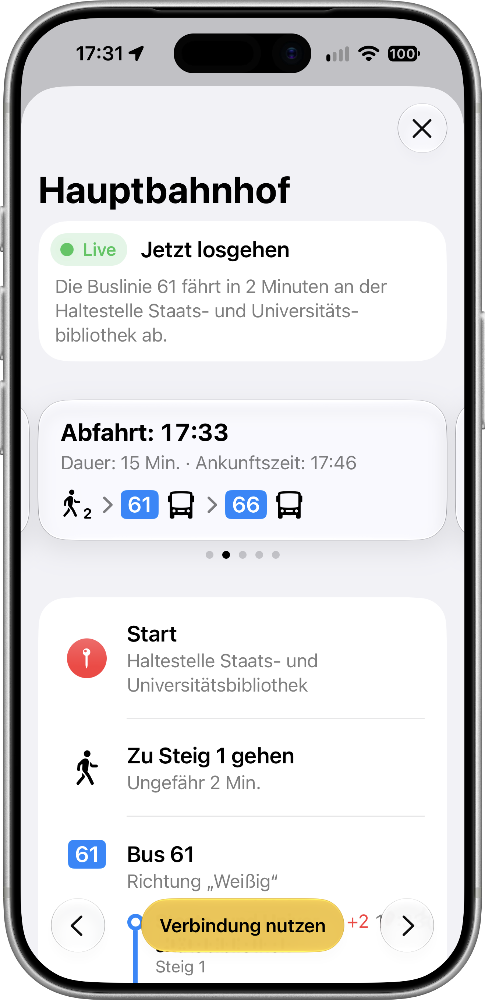

# Transit Dresden
Verbindungen, Haltestellen Live Aktivitäten und Widgets für den ÖPNV in Dresden.

> **Herkunft:** Transit Dresden ist eine stark veränderte Version von
> [Haltestellenmonitor Dresden](https://github.com/HanashiDev/Haltestellenmonitor-v3)
> von HanashiDev (Peter Lohse u. a.). Das Original-Repository ist archiviert.
> Seit Oktober 2026 wird das Projekt von mir weiterentwickelt und verändert
> (u. a. vollständig neues Layout, neues UI, Liquid Glass Support).

### Showcase
<p align="left">
  
</p>

## Software-Anforderungen
* iOS 27
* Xcode 27

## Projekt bauen und starten
```
git clone https://github.com/LukasT03/Transit-Dresden
```

1. Öffne `Transit Dresden.xcodeproj` in Xcode
2. Wähle unter *Signing & Capabilities* dein eigenes Development Team
3. Starte das Schema `Transit Dresden` mit CMD + R

App Store Version folgt.

## Lizenz
Das Projekt steht, wie das Original, unter der GNU General Public License v3.0. [Für mehr Info siehe hier](LICENSE)
